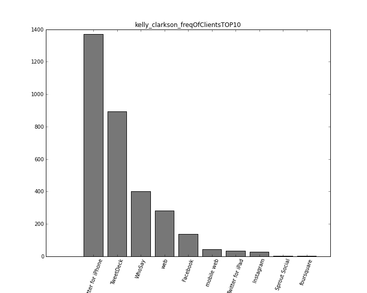
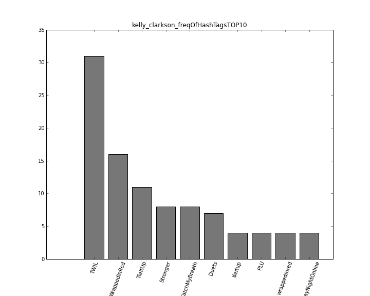
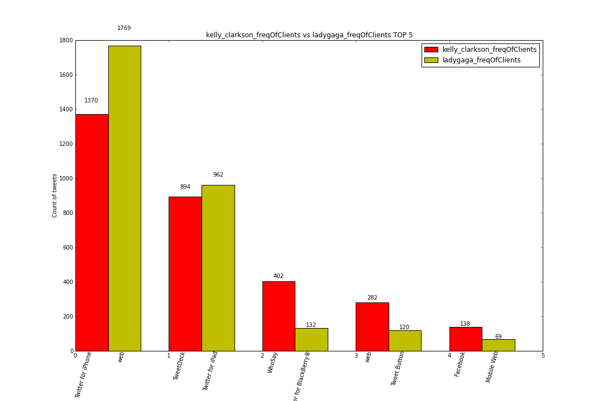

Diagramms Overview
====================

should i put all pics unter /image folder hier?
I dont think so. :)
If you want more, please go to larrybird package's folder, hier lives this ***image*** folder.
It concludes all pics, too many!!

Result
------

After the user inputs "kelly_clarkson" to the **main.start()**, this programm usese mathplotplot to create images.

We also have a function in makePicture.py module to create comparison diagramm for two twitters.
Hier ist one of them for Lady Gaga and Kelly Clarkson's Clients Comparision 

