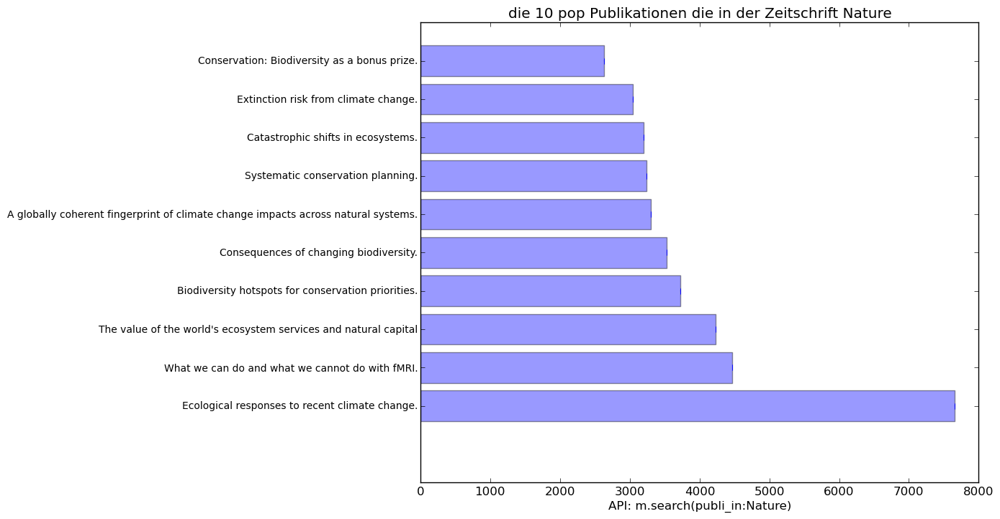
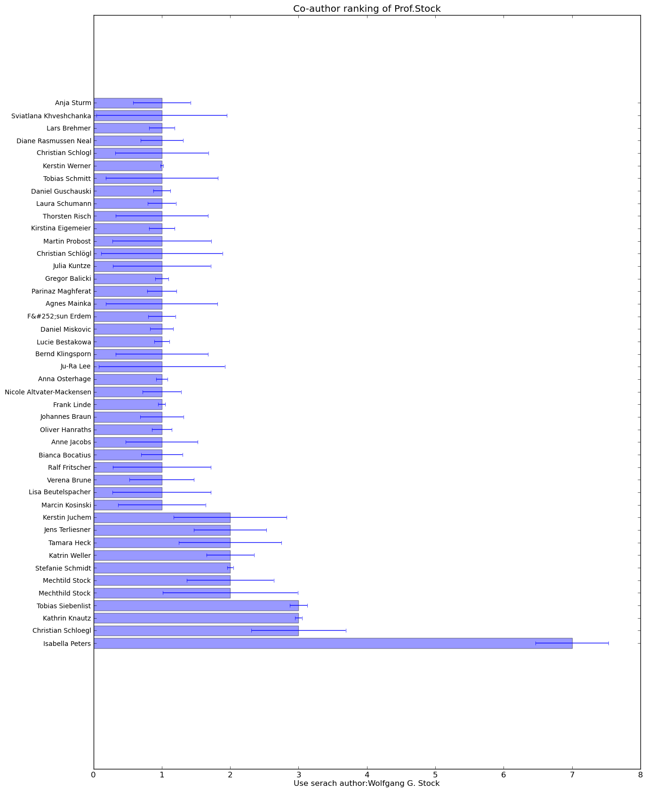

Auswertung
**************************

Verteilung der Publikationen in Mendeley auf die letzten 10 Jahre
-----------------------------------------------------------------

Grafik 1 zeigt die Verteilung der Publikationen in Mendeley für die 
letzten 10 Jahre. Die Grafik ist nach Anzahl, und nicht nach Jahren
sortiert.
Hierbei ist ersichtlich, dass im Zeitraum zwischen 2008 und 2011 die 
meisten Publikationen in Mendeley eingetragen wurden. 2003 bis 2006
weisen eine geringere Zahl auf, da dies erst die Startphase von Mendeley
war.

Grafik 1 - Verteilung der Publikationen auf die letzten 10 Jahre

Top20-Tags in der Kategorie „Computer and Information Science“
--------------------------------------------------------------

Grafik 2 stellt die 20 häufigsten Tags in der Kategorie „Computer and 
Information Science“ dar.
"security" liegt hierbei mit einem Spitzenwert von etwa 850 ganz Vorne.
Die anderen Tags verteilen sich zwischen 250 und 510.

.. image:: super_rsl/image/Top20-Tags_in_der_Kategorie_Computer_and_Information_Science.png
    :width: 800
    :align: center
    :alt: alternate text

Grafik 2 - Top20-Tags der Kategorie „Computer and Information Science“

Die 10 populärsten Publikationen die in der Zeitschrift „Nature“
----------------------------------------------------------------

Grafik 3 stellt die 10 populaersten Publikationen in der Zeitschrift
"Nature" dar.
Der klare Favorit ist hierbei die Publikation "Ecological responses 
to recent climate change" mit einem Wert von fast 8000.
Die restlichen Publikationen haben lediglich Werte zwischen 2800 und 
4500.

Grafik 3 - 10 populärsten Publikationen die in der Zeitschrift „Nature“

Auflistung aller Publikationen von Prof. Wolfgang G. Stock
----------------------------------------------------------

Folgende Titel konnten in der Mendeley Datenbank für den Namen Wolfgang 
G. Stock gefunden werden:

    * Die Bedeutung der Zitatenanalyse fuer die Wissenschaftsforschung 

    * Datenbank "Grazer Schule" 

    * Die Genese der Theorie der Vorstellungsproduktion der Grazer Schule 

    * On relevance distributions 

    * Die Bedeutung Ludwig Flecks Fuer Die Theorie der \
      Wissenschaftsgeschichte 

    * Publikation und Zitat: die problematische Basis empirischer \
      Wissenschaftsforschung 

    * Georg Klaus ueber Kybernetik und Information 

    * Die Entstehung einer wissenschaftlichen Disziplin 

    * Information Retrieval: Informationen suchen und finden 

    * Die Bedeutung der Theorie der Vorstellungsproduktion der Grazer \
      Schule fuer die kognitive Wissenschaft

    * Folksonomies and science communication 

    * Informationelle Staedte im 21. Jahrhundert 

    * Evidenzbasierte Bibliotheks- und Informationspraxis : \
      EBLIP5, Stockholm, 2009 

    * Informational cities: Analysis and construction of cities in the \
      knowledge society 

    * Concepts and semantic relations in information science

    * The inflation of impact factors of scientific journals

    * Folksonomies in Wissensrepraesentation und Information Retrieval 

    * Online-Hosts fuer Wissenschaft, Technik und Medizin auf dem deutschen\
      Informationsmarkt

    * Gender-specific information search behavior 

    * Practitioners and academics as authors and readers: the case of LIS \
      journals 

    * Impact and relevance of LIS journals: Ascientometric analysis of \
      international and German-language LIS journals - Citation analysis \
      versus reader survey 

    * "Power tags“ in information retrieval 

    * Deutsche Zeitschriften des Bibliotheks- und Informationswesens. \
      Leser, Zitate und Redaktionen in szientometrischer Analyse 

    * Intellectual property information: A comparative analysis of main \
      information providers 

    * Informationsmarkt. Informationen im I-Commerce anbieten und nachfragen 

    * Folksonomy and information retrieval 

    * Construction and Evaluation of a Blended Learning Platform for Higher\
      Education 

    * Collective Indexing of Emotions in Images. A Study in Emotional \
      Information Retrieval 

    * Intellectual property information. A case study of Questel-Orbit 

    * Dimensions of Informational City Research 

    * Dimensionen der Zeitschriftenszientometrie am Beispiel von \
      "Buch und Bibliothek" 

    * Testing Collaborative Filtering against Co-Citation Analysis and \
      Bibliographic Coupling for Academic Author Recommendation 

    * Folksonomy: The Collaborative Knowledge Organization System 

    * Expert Recommendation for Knowledge Management in Academia 

    * MEMOSE. Search Engine for Emotions in Multimedia Documents 

    * Dimensions of the scientometrics of journals: "Buch und Bibliothek" \
      as a concrete example 

    * Retrieval effectiveness of tagging systems 

    * Finding Emotional-Laden Resources on the World Wide Web 

    * Incentives for Emotional Multimedia Tagging 

    * Science and technology in the region: The output of regional science \
      and technology, its strengths and its leading institutions

Publikationsanzahl von Prof. Stock über die vorhandenen Jahre
---------------------------------------------

Grafik 4 zeigt die Publikationsanzahl von Prof. Stock pro Jahr.
Hierbei sieht man, dass die Jahre 2010 und 2011 mit 6 und 8 
Publikationen die erfolgreichsten waren.

.. image:: super_rsl/image/Publikationsanzahl_im_Jahre_von_Stock.png
    :align: center
    :alt: alternate text

Grafik 4 - Publikationsanzahl von Prof. Stock

Ranking aller Co-Autoren von Prof. Stock nach Mendeley
----------------------------------------

Grafik 5 zeigt die Co-Autoren von Prof. Stock die in Mendeley genannt 
werden. Hierbei war Isabella Peters 7 mal Co-Autor und nimmt damit
den ersten Platz ein. Den zweiten Platz teilen sich Christian Schloegl,
Kathrin Knautz und Tobias Siebenlist mit jeweils 3 Publikationen.

Grafik 5 - Co-Autoren von Prof. Stock

Häufigkeit von dem Tag "ontology" für jede Kategorie in Mendeley
----------------------------------------------------------------

Grafik 6 zeigt die Verteilung des Tags "ontology" in allen Kategorien
von Mendeley.
Artikel in der Kategorie Chemie werden mit am häufigsten mit diesem Wort
getaggt. Den zweiten Platz belegt Mathematik mit einem Wert von 12.
"Computer and Information Science" weist gerade mal einen Wert von 5 
auf.

.. image:: super_rsl/image/taged_by_ontology_in_year_2011.png
    :width: 800
    :align: center
    :alt: alternate text

Grafik 6 - Häuifigkeit des Tags "ontology" für jede Kategorie

